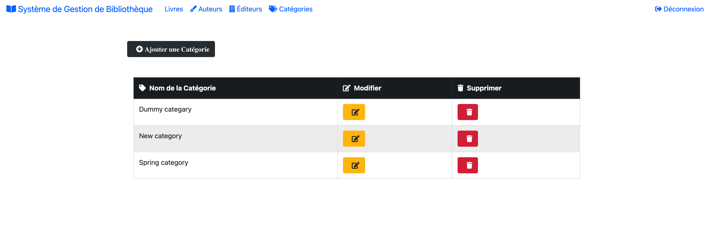
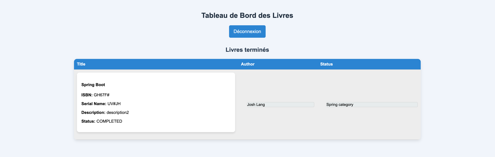

# Java, Spring Boot Mini Projet - Système de Gestion de Bibliothèque

## Lien du projet GitHub
[Repository GitHub](https://github.com/1-thegreenprogrammer/Syst-me-de-Gestion-de-Biblioth-que)

## Identifiants
- **Connexion Admin** :
    - Email : `admin@admin.in`
    - Mot de passe : `Gema123`
- **Connexion Étudiant** :
    - Email : `etudiant@gema.edu`
    - Mot de passe : `Gema123`

## Aperçu de l'Application
Cette application est un **Système de Gestion de Bibliothèque** avec deux rôles utilisateurs :
- **Étudiant** : Peut parcourir les livres disponibles dans la bibliothèque.
- **Admin** : Gère les livres, les auteurs, les catégories et les éditeurs.

## URL de l'Application
- L'application fonctionne sur : `http://127.0.0.1:8080`

## Installation Locale

### Remarque
L'application utilise une base de données MySQL dans un conteneur avec les identifiants mentionnés ci-dessous. Vous devez configurer le conteneur MySQL localement pour y accéder.

### Configuration de la base de données MySQL dans un conteneur
Exécutez la commande suivante pour créer un conteneur MySQL avec les bonnes configurations :
```sh
docker run --name mysql-library -e MYSQL_ROOT_PASSWORD=rootpassword -e MYSQL_DATABASE=library_db -p 3306:3306 -d mysql:8.0
```

Assurez-vous que le conteneur est en cours d'exécution avant de démarrer l'application.

### Remarque
L'application utilise MySQL dans un conteneur. Vous devez installer MySQL localement pour y accéder.

### Étape 1 : Cloner le Dépôt
Téléchargez ou clonez le code source depuis GitHub vers votre machine locale.

### Étape 2 : Installer les Prérequis
- Installer **JDK 17** : [Télécharger JDK 17](https://www.oracle.com/java/technologies/javase/jdk17-archive-downloads.html)
- Installer **Maven** : [Télécharger Maven](https://maven.apache.org/install.html)
- Installer un IDE (Optionnel) : IntelliJ IDEA, Eclipse ou Apache NetBeans

### Étape 3 : Compiler et Exécuter l'Application
```sh
mvn clean install
mvn spring-boot:run
```

### Étape 4 : Accéder à l'Application
Ouvrez votre navigateur et visitez :
```
http://127.0.0.1:8080
```

## Pile Technologique
- **Java 17**
- **Spring Boot**
- **Maven**
- **MySQL** (Conteneur Docker)
- **Thymeleaf / React (Optionnel pour le Frontend)**

## Configuration de l'Application
Ajoutez les configurations suivantes dans `application.properties` :
```properties
server.port=8080
server.error.whitelabel.enabled=false

# Configuration de la connexion
spring.datasource.url=jdbc:mysql://localhost:3306/library_db
spring.datasource.username=root
spring.datasource.password=rootpassword

# Configuration JPA
spring.jpa.hibernate.ddl-auto=create-drop
spring.jpa.show-sql=true
spring.jpa.properties.hibernate.format_sql=true
spring.jpa.properties.hibernate.dialect=org.hibernate.dialect.MySQL8Dialect

# Logging
logging.level.org.hibernate.SQL=DEBUG
logging.level.org.hibernate.type.descriptor.sql.BasicBinder=TRACE
```

## Captures d'écran

### Page de Connexion


### Interface de l'Application d'Admin


### Interface de l'Application d'un Utilisateur Normal


---
Ce projet est conçu pour gérer efficacement les opérations de la bibliothèque, offrant une interface simple et intuitive pour les administrateurs et les étudiants.
# Syst-me-de-Gestion-de-Biblioth-que
